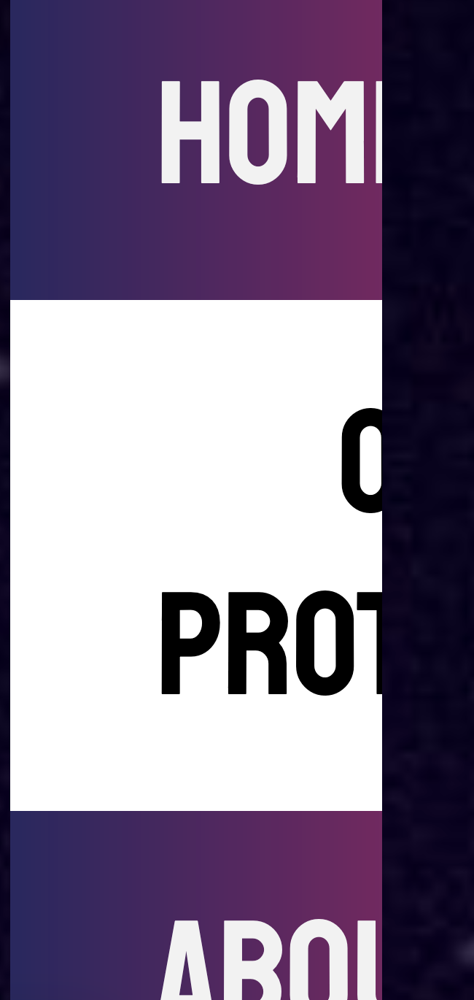

# Protbot UARs

By: Violet Monserate

## ID: MAG-00: Moving Text

### Brief Description

Text moves on the screen without user input.

### Evidence

Looking deeper into the code, we see the following code to make text scroll right to left

    <marquee behavior="scroll" direction="left" scrollamount="15" onmousedown="this.stop();" onmouseup="this.start();">
          Created by Violet Monserate, Alex Vicuna Perez, and Sophia Lam
    </marquee>

Here are images of what that renders into. 

.

These images also don't convey how quickly the text moves, espeically when you are zoomed in at levels >200%.

### Explanation

Guidelines violated: 2.2.2 (Pause, Stop, Hide). This one states that moving text, in this case marquees, that lasts longer 5 seconds should be able to be paused, which this is not able to be unless the user holds down the mouse button. This makes it hard to percieve due to motion blur and how the text has to followed across the screen to be read. It also can be distracting and confusing to users. 

### Severity
#### Severity Rating: 4/5

#### Frequency

Very VERY frequent issue. The scrolling happens consistently, and doesn't stop at all. It is at the header of all of seperate pages. 

#### Impact

The impact is high because the continuously scrolling bar is distracting and detracts from other parts of the webpage. It becomes a barrier to reading the webpage and understand the content.

#### Persistence

The main fix is to click to stop the animation from moving, but the mouse has to be held down, which is difficult. Otherwise, there is no user-facing solution to this. 

### Relationships to other problems reported (if relevant)

This is slightly related to the issue of text clipping, as the moving text causes the text to clip on the left and right edges of the screen.

## ID: MAG-01: Text Clipping and Button

### Brief Description

Text goes off screen when it should not. 

### Evidence

There was also an issue with the navbar. The cliable links started to clip as zoom level went up. 

### Explanation

Guideline violated: 1.4.4 (Resize text). This is a violation because content because with some letters cut off, the text because unintelligible and thus impercievable to users. There should be at least an option for users to scroll to see the entire text, but that doesn't even work.

### Severity

#### Severity Rating: 5/5

#### Frequency

This issue happens whenever text size increases. It is present on all of the webpages. 

#### Impact

The impact is great for this, as it causes the user to not know where they are, or to lose out on important content/context within the image (which could also be a navigation issue).

#### Persistence

There is no real fix from the end-user's perspective. This will keep happening (without their knowledge, perhaps) while there is only null text.

### Relationships to other problems reported (if relevant)

The clipping is further made an issue because of how the headers are not very perceivable due to their strange formatting. 

## ID: SR-00: Poorly Formatted Headers

### Brief Description

Some of the headers don't work how they should or navigation is unclear.

### Evidence

For example, there are skipped header levels: 

    <h1>
        ProtBot
    </h1>
    <h3>
        Marquee<marquee behavior="scroll" direction="left" scrollamount="15" onmousedown="this.stop();" onmouseup="this.start();">
            Created by Violet Monserate, Alex Vicuna Perez, and Sophia Lam
        </marquee>
    </h3>

On all of the headers using different colors, the following comes up with the screen reader:

### Explanation

Guidelines violated: 1.3.1 (Info and Relationships) and 2.4.6 (Headings and Labels). This is an issue because it can lead users astray while using the website. This makes the website more unpredictable and less easy to navigate. Especially since the given h3 is actually just a subheader naming the creators. While using the screen reader, I was confused why there were "2 items" within the header, and what that could possible mean. Overall, more confusion for the user due to these issues.

### Severity
#### Severity Rating: 5/5

#### Frequency

This happens at most of the headers, and the h1 to h3 gap is on each of the different pages that can be navigated to. 

#### Impact

The impact is high because of how there is no explanation for the screen reader error, for example. Overall, very difficult for users to overcome.

#### Persistence

There's no feasible way for users to make this issue go away. It will keep cropping itself up because of how prevelent it is throughout the application. 

### Relationships to other problems reported (if relevant)

This is related to  the clipping of the header. Having poorly formatted headers makes the headers even less percievable and usable since there is less information provided to the user. 
